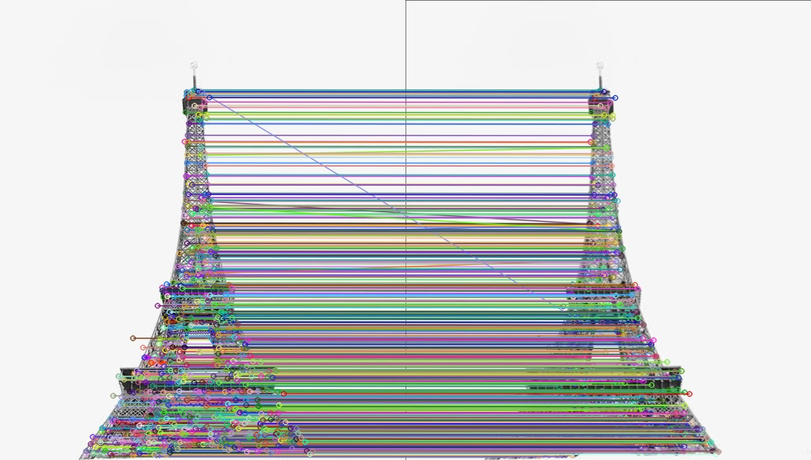
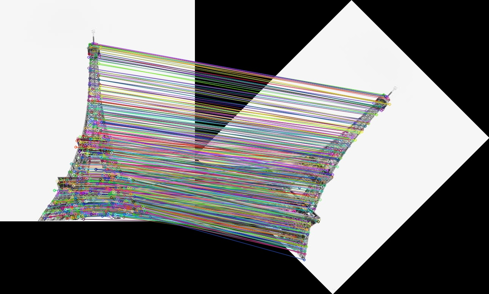
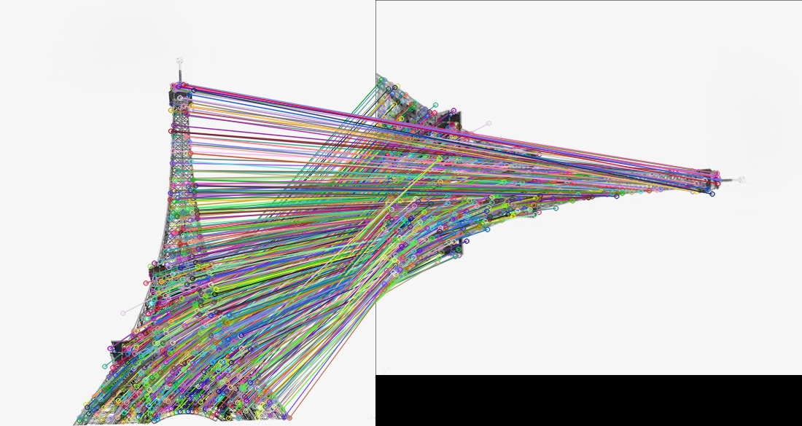
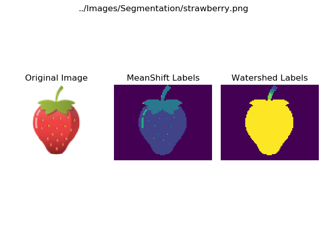
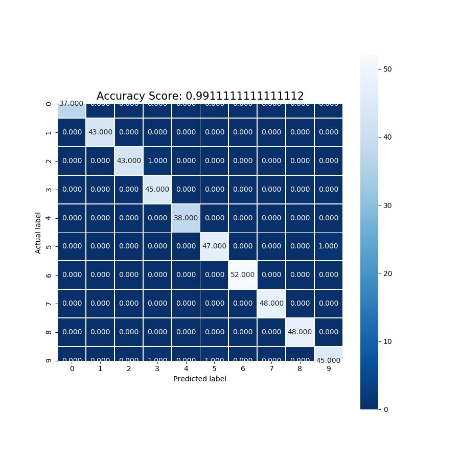
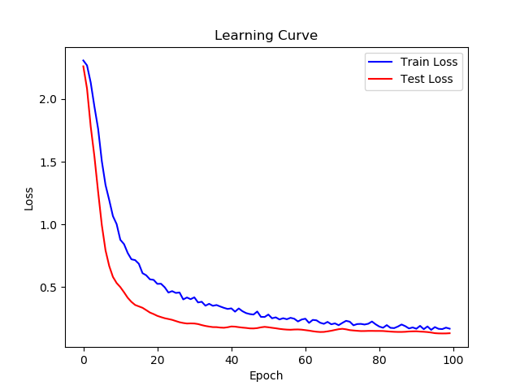
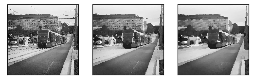
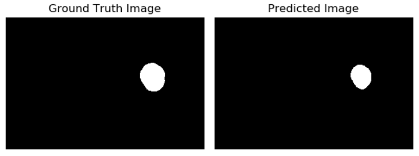
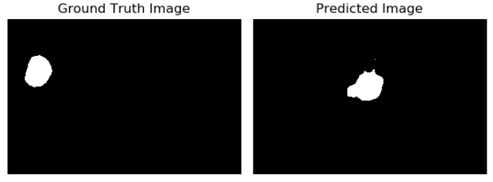

# Machine-Vision

This repository consists of algorithms related to Images processing, Features, Segmentation, Pattern Recognition and Deep learning focused on Images. It consists of problems which are 
manipulated in both the traditional and the AI way.

### Installation

All the packages required for the repository, can be obtained using the command

> pip install requirements.txt

### Datasets:

1) **Deep Learning**: The dataset for the deep learning code is MNIST image dataset but in the tabular format where every tuple indicates an image.

    Elements per row: ( 28 * 28 ) image with a label = 785 elements

    `The dataset is highly visible online`
    
2) **Optic Disc Segmentation**: The dataset for the optic disc segmentation can be acquired from [IDRiD](https://idrid.grand-challenge.org/) and store the dataset in the Images folder 
    directory. 
    
    The directory representation is as follows: 

        -> Images 
              -> IDRiD
                   -> optic_disc_segmentation_masks
                        -> Label images (54 samples)
                   -> original_retinal_images
                        -> Input images (54 samples)
                        
All the datasets required for other related problems are provided with the repository.
                        

### Results and Comparisons

1) **Feature extraction**: Feature extraction is done using the SIFT algorithm which is a texture based feature extractor which extracts keypoints
    in an image. SIFT is applied on an Eiffel Tower image and we check how SIFT is able to match the keypoints from the original image and the rotated image.
    1) Rotated Image angle 0 degrees:
    
        
        
    2) Rotated Image angle of 45 degrees:
    
        
        
    3) Rotated Image angle of 90 degrees:
    
        
        
    Other comparisons are available in `OutputImages/Sift`
    
    Code available at: `src/sift.py`

2) **Segmentation**: The segmentation algorithms that are evaluated and compared are `Water Shed` and `Means Shift` algorithm.
    1) The segmentaion results on a strawberry toy image is:
    
        
        
    Other comparisons are available in `OutputImages/Segmentation`
    
    Code available at: `src/segmentation.py`

3) **Pattern Recognition**: The confusion matrix for the result obtained from KNN on the `scikit-learn` digits dataset is:

    

    Code available at: `src/pattern_recognition.py`
    
4) **Deep Learning**: The loss vs epochs graph for the `deep_learning` code on MNIST dataset is: 

    
    
    Code available at: `src/deep_learning.py`
    
5) **Oil Painting**: Oil painting is implemented from scratch as part of the learning process 
    of manipulating images and it is implemented on a Sydney tram image. Oil 
    painting is done on the image using different filter sizes and the results are:

    

    For detailed description about the project kindly look at the paper
    `report/Oil-Paint-report.pdf` where everything about the implementation is explained visually.
    
    All the codes related are available in the directory `src/Oil-Paint`. 

6) **Optic Disc Segmentation**: The Optic Disc Segmentation is evaluated on the IDRiD dataset with 54 images: 
    1) Image of a good prediction of the optic disc:
    
        
    
    2) Image of a bad prediction of the optic disc:
    
        
        
    For detailed description about the project kindly look at the paper
    `report/IDRiD/paper.pdf` which explains the implementation in detail and also 
    about the reasons for the prediction.
    
     All the codes related are available in the directory `src/IDRiD`.
     
### Acknowledgement

I would like to thank Arcot Soumya and her team for supporting us with the materials and knowledge required to learn Machine Vision.
        
    

